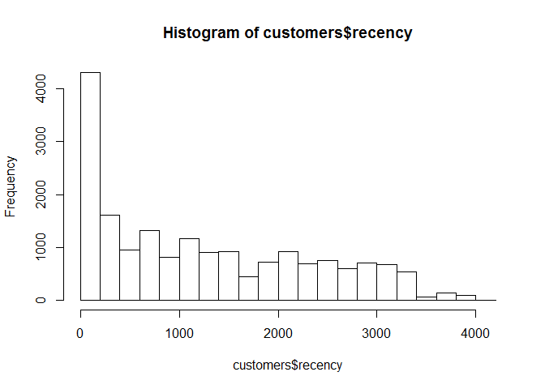
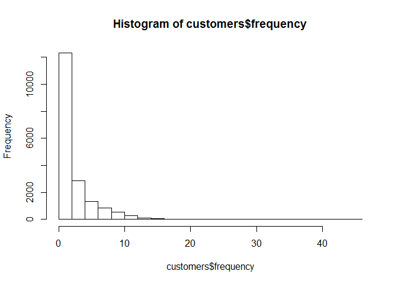
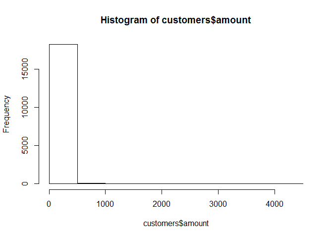
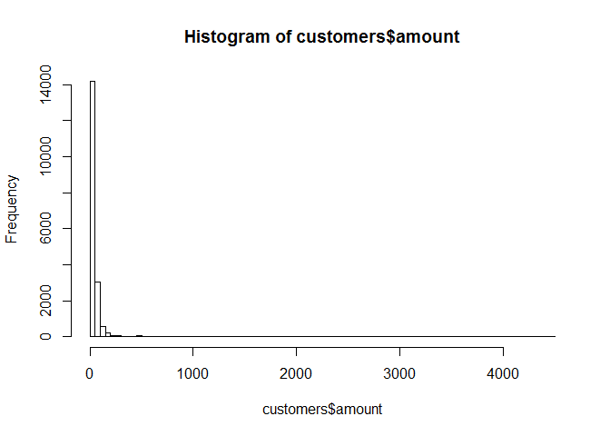

# R Markdown Test
Nils  
12 oktober 2017  


Check out this glorious code:


```
## Warning: package 'sqldf' was built under R version 3.3.3
```

```
## Loading required package: gsubfn
```

```
## Warning: package 'gsubfn' was built under R version 3.3.3
```

```
## Loading required package: proto
```

```
## Warning: package 'proto' was built under R version 3.3.3
```

```
## Loading required package: RSQLite
```

```
## Warning: package 'RSQLite' was built under R version 3.3.3
```

<!-- --><!-- --><!-- --><!-- -->

