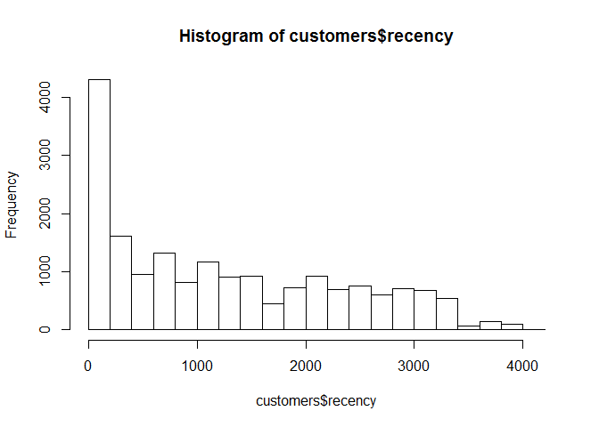
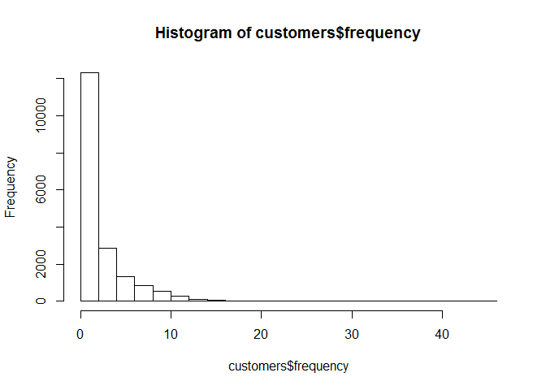
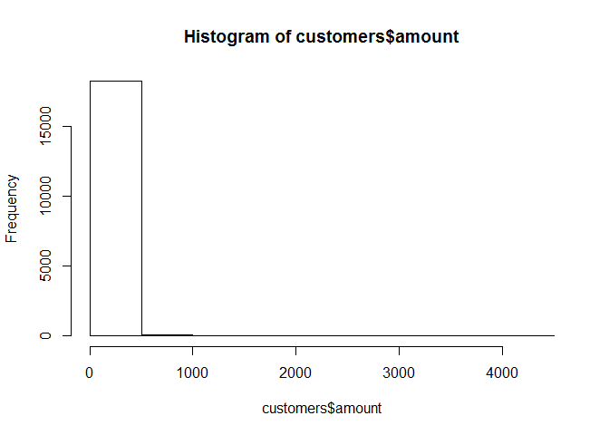
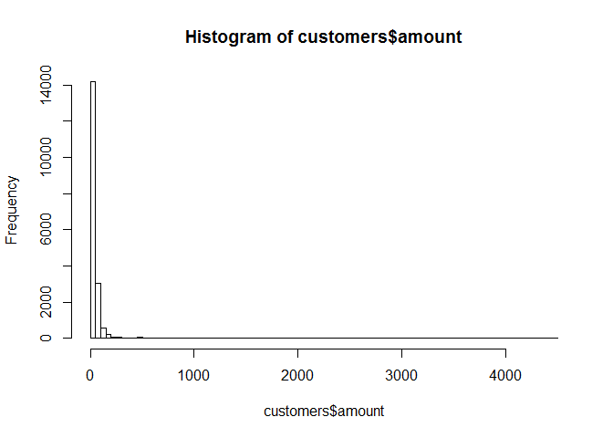

R Markdown Test
================
Nils
12 oktober 2017

Check out this glorious code:

``` r
data = read.delim(file = 'purchases.txt', header = FALSE, sep = '\t', dec = '.')

colnames(data) = c('customer_id', 'purchase_amount', 'date_of_purchase')
data$date_of_purchase = as.Date(data$date_of_purchase, "%Y-%m-%d")
data$days_since       = as.numeric(difftime(time1 = "2016-01-01",
                                            time2 = data$date_of_purchase,
                                            units = "days"))

# Compute key marketing indicators using SQL language
library(sqldf)
```

    ## Warning: package 'sqldf' was built under R version 3.3.3

    ## Loading required package: gsubfn

    ## Warning: package 'gsubfn' was built under R version 3.3.3

    ## Loading required package: proto

    ## Warning: package 'proto' was built under R version 3.3.3

    ## Loading required package: RSQLite

    ## Warning: package 'RSQLite' was built under R version 3.3.3

``` r
# Compute recency, frequency, and average purchase amount
customers = sqldf("SELECT customer_id,
                          MIN(days_since) AS 'recency',
                          COUNT(*) AS 'frequency',
                          AVG(purchase_amount) AS 'amount'
                   FROM data GROUP BY 1")

# Explore the data
#head(customers)
#summary(customers)
hist(customers$recency)
```



``` r
hist(customers$frequency)
```



``` r
hist(customers$amount)
```



``` r
hist(customers$amount, breaks = 100)
```


